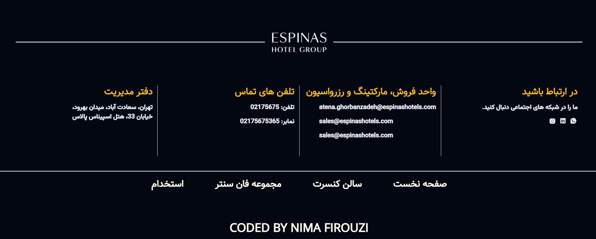
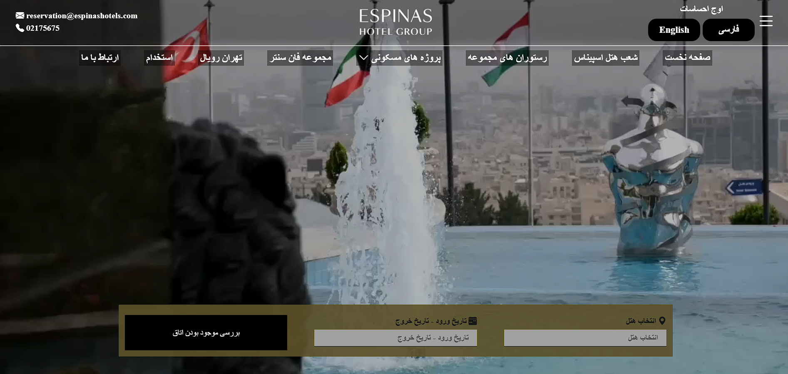
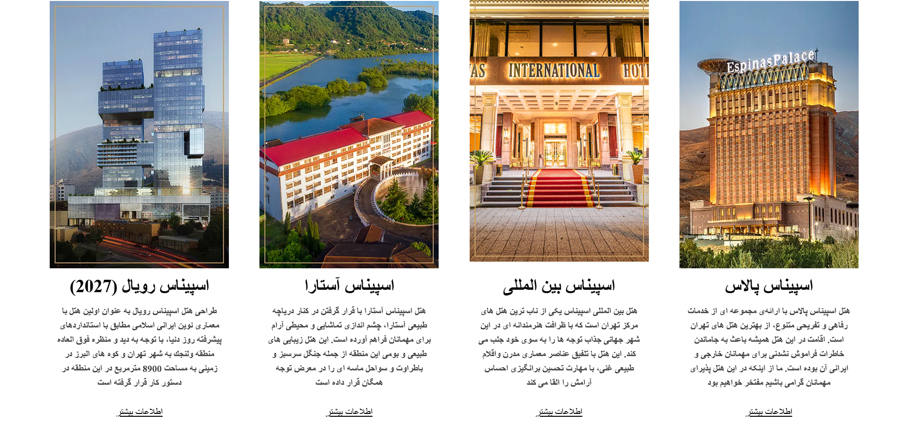

# fa-tailwind

  

#
"This project aims to demonstrate Tailwind's skill level in Persian. I’d appreciate it if you could take a look and share your feedback with me."
# ONLINE DEMO

# Library used:

# SCREEN-SHOT

 
